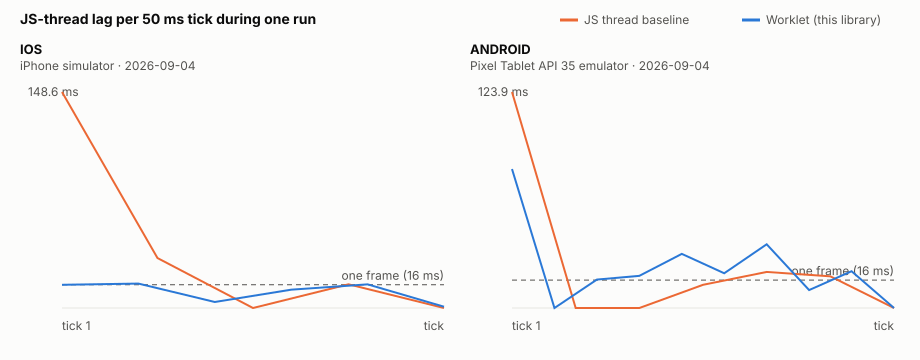
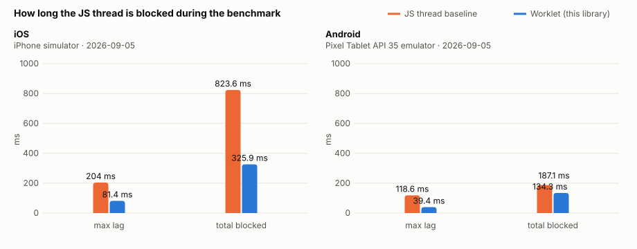
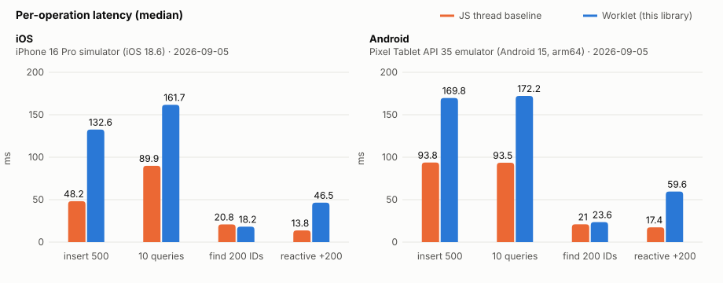
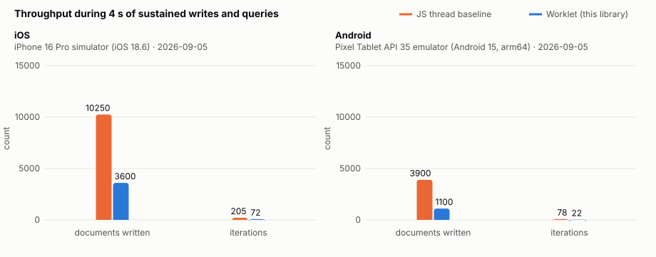

# rxdb-storage-worklet

Run RxDB's filesystem storage on a [react-native-worklets](https://docs.swmansion.com/react-native-worklets/) Worker Runtime, so the React Native JS thread never does storage work.

**Status: pre-release.** iOS and Android, Expo SDK 57 / React Native 0.86, RxDB 17.4. Built by [WCPOS](https://wcpos.com) for its point-of-sale app and offered to the RxDB project as a contribution.

## Why

On React Native an RxDB storage runs on the JavaScript thread. Indexing, JSON parsing and file I/O all happen there, so a bulk write during sync or a query on a screen open is a stall the user feels as a frozen interface. Web runs the same engine in a Web Worker and Electron in the main process; native had nothing equivalent.

This library moves the storage to a Worker Runtime hosted by react-native-worklets, the multithreading engine behind Reanimated. RxDB's own [remote storage protocol](https://rxdb.info/rx-storage-remote.html) carries requests across the runtime boundary, the same way the browser worker plugin does. The engine itself, rxdb-premium's `storage-abstract-filesystem`, runs unchanged. Only the file primitive underneath it and the thread it runs on are new.

## Results

What you gain is responsiveness. What you pay is a round trip per storage request.

<picture>
  <source media="(prefers-color-scheme: dark)" srcset="benchmarks/charts/lag-timeline-dark.svg">
  
</picture>

Under four seconds of continuous writes and queries, the baseline blocks the JS thread for the entire four seconds. Nothing renders, no touch is handled. On the worklet the same load leaves the thread free: p95 lag 33 ms on the iOS simulator, 155 ms on the Android emulator.

<picture>
  <source media="(prefers-color-scheme: dark)" srcset="benchmarks/charts/js-thread-stall-dark.svg">
  
</picture>

| Whole short benchmark | JS thread | Worklet |
|---|---:|---:|
| iOS max lag | 281 ms | 29.6 ms |
| iOS sum of lateness | 413 ms | 462 ms |
| Android max lag | 328 ms | 33.4 ms |
| Android sum of lateness | 475 ms | 529 ms |

The worst single stall drops by about 10×. The sum of lateness is slightly higher on the worklet because the thread now sees many small late ticks (message handling, the on-screen counter) instead of one long freeze; that is the shape you want for a UI.

<picture>
  <source media="(prefers-color-scheme: dark)" srcset="benchmarks/charts/operation-latency-dark.svg">
  
</picture>

| Per operation (median) | iOS JS thread | iOS worklet | Android JS thread | Android worklet |
|---|---:|---:|---:|---:|
| insert 500 documents (~5 KB each) | 48 ms | 133 ms | 94 ms | 170 ms |
| 10 sorted queries, limit 50 | 90 ms | 162 ms | 94 ms | 172 ms |
| find 200 by id | 21 ms | 18 ms | 21 ms | 24 ms |
| insert 200, wait for the live query | 14 ms | 47 ms | 17 ms | 60 ms |

End-to-end latency per operation is higher on the worklet. Serialisation is not the cost: `JSON.stringify` on the RN side takes 0.007 ms per request and the scheduling call 0.09 ms. The cost is the round trip itself, about 12 ms on iOS and 18 ms on Android per request, most of it queue latency between the two event loops. Batch-shaped work (a sync page of 100 documents) pays it once; request-per-item loops pay it every time.

<picture>
  <source media="(prefers-color-scheme: dark)" srcset="benchmarks/charts/sustained-throughput-dark.svg">
  
</picture>

| 4 s sustained loop | JS thread | Worklet |
|---|---:|---:|
| iOS documents written | 10,250 | 3,600 |
| Android documents written | 3,900 | 1,100 |

Raw throughput of a tight loop is 65% lower on iOS and about 70% lower on the Android emulator, whose runs drift between samples and should be read as indicative only. Reducing the round trip (coalescing replies, tuning the worker runtime's queue) is the open performance work; it is tracked in the issues and does not change the architecture.

All numbers: iPhone 16 Pro simulator (iOS 18.6) and Pixel Tablet API 35 emulator (Android 15, arm64), 2026-09-05, three samples per mode, medians, every raw sample kept in [`benchmarks/`](benchmarks/). Real devices have not been measured yet. Reproduce with [`benchmarks/README.md`](benchmarks/README.md).

## How it works

```text
React Native JS thread                      Worker Runtime (react-native-worklets)
┌──────────────────────────┐   JSON string   ┌────────────────────────────────────┐
│ RxDB core                │  per message    │ exposeWorkletRxStorage             │
│ getRxStorageWorklet() ───┼────────────────▶│  └ storage-abstract-filesystem     │
│  (rxdb storage-remote)   │◀────────────────┼     └ worklet-opfs (OPFS-shaped)   │
└──────────────────────────┘  scheduleOnRN   │        └ react-native-worklet-fs   │
                                             │           (C++ JSI over POSIX)     │
                                             └────────────────────────────────────┘
```

- **One JSON string per message.** Measured against deep-copying document graphs with `createSerializable`, the string envelope cut the RN-thread cost of a 500-document write from 210 ms to 30 ms. Attachments cross as base64.
- **A positional file primitive.** `react-native-worklet-fs` is a pure C++ TurboModule that installs `open / readAt / writeAt / truncate / size / flush / close / mkdir / readdir / remove / exists` plus UTF-8 helpers into the worker runtime, under the runtime's own lock. Reads and writes loop to the full range; no base64, no string round trips for file bytes.
- **An OPFS-shaped layer.** `worklet-opfs` mirrors expo-opfs's surface and semantics so rxdb-premium's abstract filesystem storage runs on it byte for byte. It also polyfills what a worker runtime lacks: `DOMException`, `TextEncoder`/`TextDecoder` (with `fatal` and BOM handling), `Blob`, and `crypto.subtle.digest` for SHA-256.

## Packages

| Package | What it is |
|---|---|
| `rxdb-storage-worklet` | `getRxStorageWorklet()` for the RN side, `exposeWorkletRxStorage()` for the worker side. The worklet analogue of RxDB's `storage-worker` plugin. |
| `worklet-opfs` | OPFS-shaped file API over `react-native-worklet-fs`, the runtime polyfills, and the adapter and lock rxdb-premium's abstract filesystem expects. Runs in Node too, which is how the conformance suite uses it. |
| `react-native-worklet-fs` | The native primitive: C++ JSI file functions installed into a worklet runtime or the RN runtime. Ships a Node implementation under `react-native-worklet-fs/node`. |

## Install

```sh
npx expo install react-native-worklets react-native-reanimated
pnpm add rxdb-storage-worklet worklet-opfs react-native-worklet-fs
pnpm add rxdb rxdb-premium   # the filesystem engine is rxdb-premium's storage-abstract-filesystem
npx expo prebuild
```

Requirements: Expo SDK 57 / React Native 0.86 with the New Architecture and Hermes, `react-native-worklets` 0.11.x, RxDB and RxDB Premium 17.4.x. `react-native-worklet-fs` is a pure C++ TurboModule with a codegen spec; autolinking picks it up on both platforms without patching React Native.

### Bundle Mode

The worker runtime runs a whole library (RxDB, rxjs, this package), which react-native-worklets only supports in [Bundle Mode](https://docs.swmansion.com/react-native-worklets/docs/bundleMode/). Three things to set up, all shown in [`example/`](example/):

1. **Babel**: the worklets plugin with `bundleMode: true` and every package the worker imports listed under `importForwarding.moduleNames` (`rxdb`, `rxjs`, the `rxdb/plugins/*` you use, `rxdb-premium/plugins/storage-abstract-filesystem`, `rxdb-storage-worklet`, `worklet-opfs`, `react-native-worklet-fs`), plus `relativePaths` for your own source folders the worker touches.
2. **Metro**: wrap your config with `getBundleModeMetroConfig`. If you use uniwind, its wrapper goes outermost.
3. **Patches**: Bundle Mode needs the `metro` and `metro-runtime` patches from the worklets repository, and until [reanimated #9817](https://github.com/software-mansion/react-native-reanimated/issues/9817) is merged, a one-file patch to `react-native-worklets` so its `react-native` shim survives other Metro resolvers. All three are in [`example/patches/`](example/patches/) for `patch-package`.

## Usage

The worker side is a worklet that builds the storage and exposes it; the RN side hands the resulting storage to `createRxDatabase`. Bundle Mode requires the reply function to be defined on the RN runtime and passed in, which is why `receiveWorkletMessage` travels as an argument.

```ts
// storage.ts (React Native side)
import { createWorkletRuntime, scheduleOnRuntime, scheduleOnRN } from 'react-native-worklets';
import { getRxStorageAbstractFilesystem } from 'rxdb-premium/plugins/storage-abstract-filesystem';
import { getRxStorageWorklet, exposeWorkletRxStorage, receiveWorkletMessage } from 'rxdb-storage-worklet';
import { getWorkletFs, installWorkletFs } from 'react-native-worklet-fs';
import {
  createAbstractFilesystemAdapter, createPromiseQueueLock,
  createWorkletOpfs, installWorkletRuntimePolyfills,
} from 'worklet-opfs';

const runtime = createWorkletRuntime({ name: 'rxdb-storage' });
installWorkletFs(runtime); // native file API into the worker runtime

function exposeStorage(rootDirectory: string, receiveOnRN: typeof receiveWorkletMessage) {
  'worklet';
  installWorkletRuntimePolyfills({ fs: getWorkletFs() });
  const storage = getRxStorageAbstractFilesystem({
    name: 'worklet-filesystem',
    abstractFilesystem: createAbstractFilesystemAdapter(createWorkletOpfs({ rootDirectory })),
    abstractLock: createPromiseQueueLock(),
    inWorker: true,
    settings: { decoder: { decode: (data) => new TextDecoder().decode(data) } },
  });
  void exposeWorkletRxStorage({ storage, identifier: 'app', receiveOnRN, scheduleOnRN });
}

scheduleOnRuntime(runtime, exposeStorage, rootDirectory, receiveWorkletMessage);

export const storage = getRxStorageWorklet({ runtime, identifier: 'app' }); // -> createRxDatabase({ storage })
```

`rootDirectory` is where the files live. On iOS you can derive it from `getWorkletFs().documentDirectory()`; on Android pass one, for example from `expo-file-system`'s `Paths.document` with the `file://` prefix removed. Everything RxDB does with a storage works unchanged: collections, queries, subscriptions, attachments, replication. Only the storage moved threads. See [`example/src/storage-runtime.ts`](example/src/storage-runtime.ts) for the complete wiring, and the package README for receive-binding, lifetime and durability notes.

## Testing

Every layer has its own proof, and the RxDB suite is the one that counts. CI runs all four jobs on every push: unit tests, RxDB conformance, iOS simulator smoke, and Android emulator smoke (the latter three require `RXDB_PREMIUM`). Hosted benchmarks are opt-in via `workflow_dispatch` with `benchmark=true`.

| Level | What runs | Command |
|---|---|---|
| Unit (53 tests) | OPFS semantics against the Node backend: name validation, DOMException contract, cursor, zero-pad past EOF, truncate, one handle per path, short reads and writes, NUL rejection; polyfills including UTF-8 `fatal`/BOM and SHA-256 vectors; the channel: an RxDB CRUD plus subscription round trip through fake runtimes asserting string-only messages, two storages on two runtimes, close and reopen through the same storage, shutdown ordering, error surfacing. | `pnpm test` |
| RxDB conformance (57 × 2) | RxDB's own `rx-storage-implementations` suite at tag 17.4.0, run through this library's real JSON channel with fake schedulers, against the filesystem engine over `worklet-opfs` and against RxDB's memory storage as the control. Sixteen real decoding bugs were found and fixed here before release. | `pnpm conformance` |
| On device | Eight storage scenarios on the worker runtime through the public API (bulk writes and conflicts, indexed and non-indexed sort, count, `findDocumentsById`, change stream and checkpoint, attachments, cleanup, close and reopen), plus the six-mode benchmark flow. Maestro, iOS simulator and Android emulator. | `example/.maestro/*.yaml` |
| Independent review | A second-model read-only review before merge; its findings and their fixes are in [`docs/reports/`](docs/reports/). | |

## Compatibility

| | Tested with | Notes |
|---|---|---|
| Expo / React Native | SDK 57 / 0.86.3 | New Architecture and Hermes required by worklets |
| react-native-worklets | 0.11.4 | Reanimated 4.5 peers `0.10.x – 0.11.x`; Bundle Mode documented from 0.10 |
| RxDB / RxDB Premium | 17.4.0 | core and premium must be the same version |
| iOS | 18.6 simulator | |
| Android | API 35 emulator | pass `rootDirectory` |

Version-specific behaviour is dated and re-tested on each React Native and worklets release.

## Durability

The filesystem engine is rxdb-premium's; this library changes where it runs, not how it writes. Writes are acknowledged when the engine has handed the bytes to the OS, and the engine coordinates its own document, index and changelog files. Power loss between those writes is the engine's failure model, not something this layer adds to or removes; `flush()` is exposed for callers who need an explicit sync point.

## Contributing and upstream

This library is being dogfooded in the WCPOS app first. Once it has run on real devices and real stores for a while and the round-trip cost is understood, three upstream conversations follow, in this order:

- **Software Mansion**: the fix for reanimated #9817 (Bundle Mode next to Metro resolvers that remap `react-native`), carried here as a patch until then.
- **RxDB**: `rxdb-storage-worklet` as `plugins/storage-worklet` beside `storage-worker`, and `worklet-opfs` as a sibling of `expo-opfs`; the conformance run in this repo is the evidence.
- **React Native**: Android autolinking only emits a pure C++ TurboModule provider when the package also has a codegen `libraryName`; the documented `cxxModule*` keys alone are skipped. This library ships the codegen spec to work within that.

Issues and PRs are welcome. Run `pnpm test`, `pnpm typecheck` and `pnpm conformance` before opening one.

## License

MIT © 2026 WCPOS
